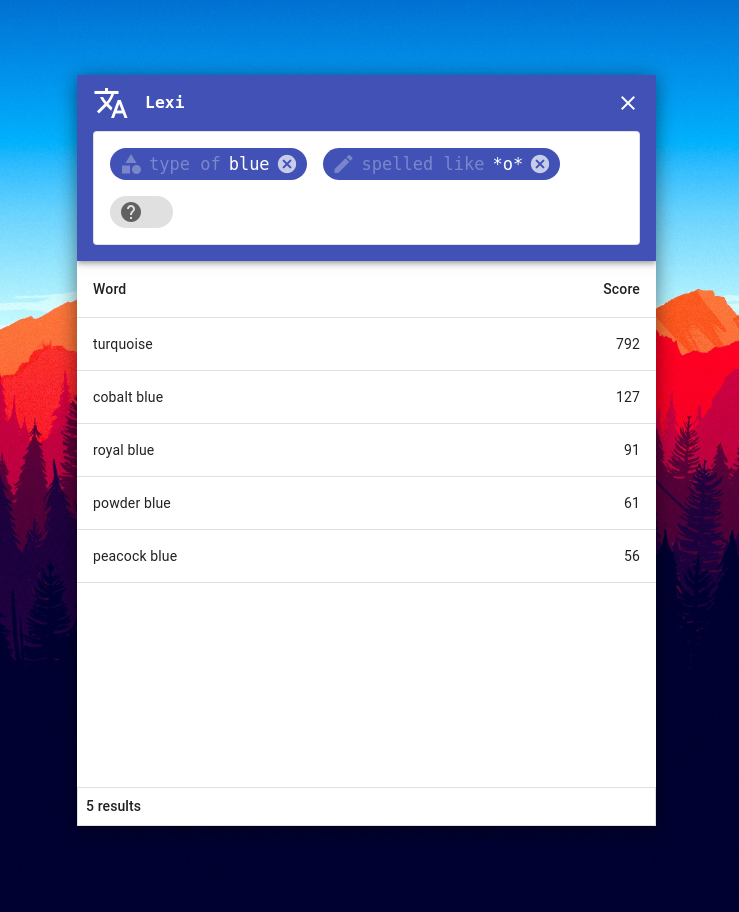
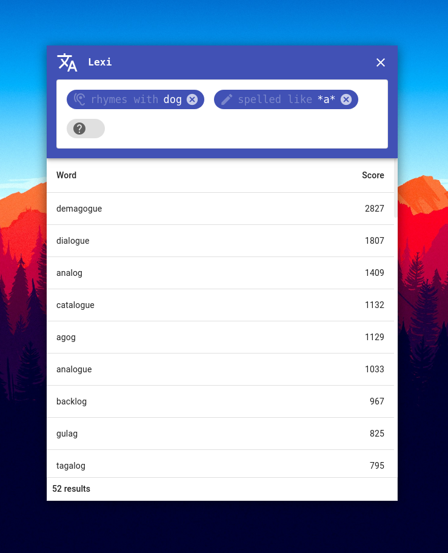
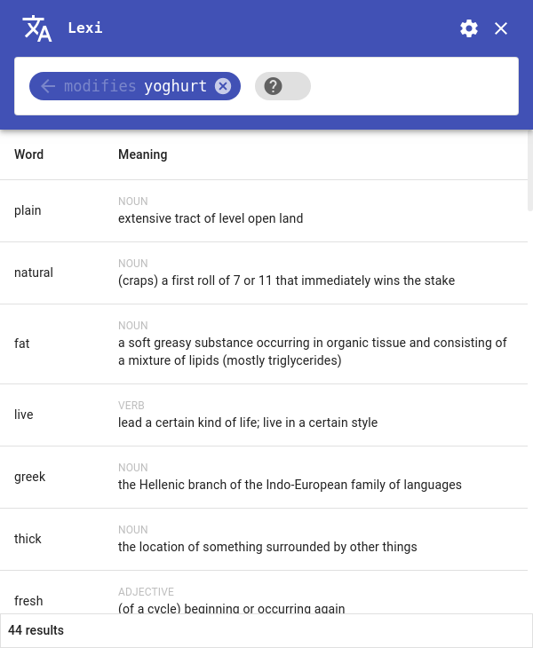

# Lexi
A beautiful, high-speed desktop lexical search utility

Lexi is a small desktop utility designed to make searching for words by phonetic and symantic characteristics very fast and enjoyable.

  
